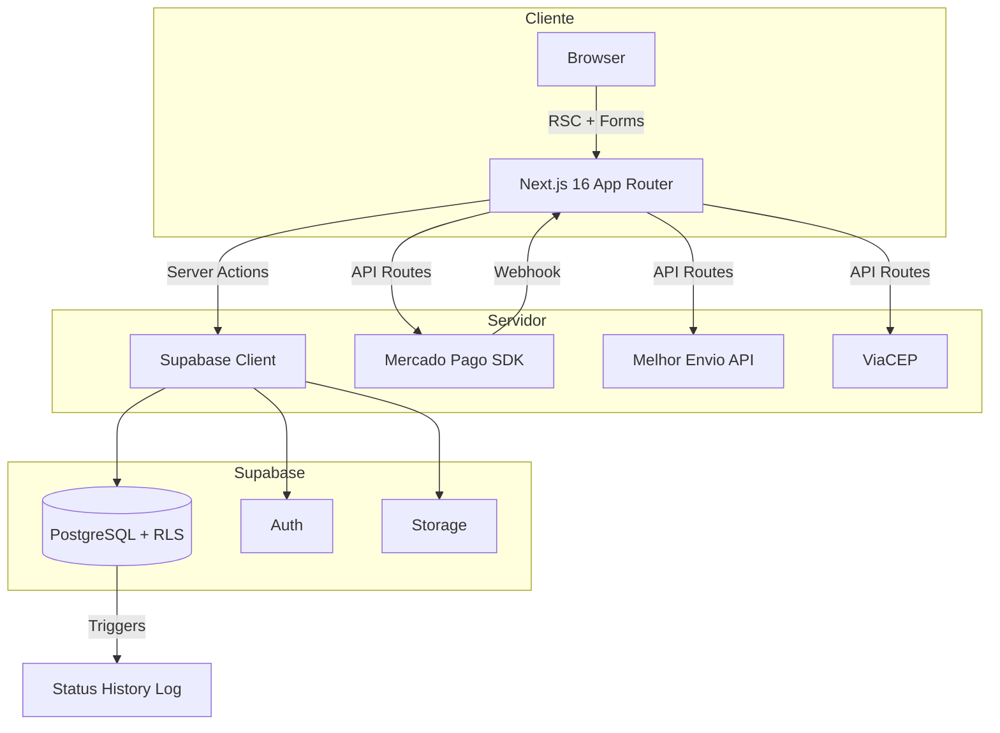

# Ariz Joias

**E-commerce completo de joias em prata 925 com checkout Mercado Pago, cálculo de frete real via Melhor Envio e painel administrativo — construído para uma marca real.**


---

## 🎯 Sobre o projeto

Ariz Joias é a loja virtual de uma marca brasileira de joias em prata 925. O sistema resolve o problema de venda direta ao consumidor com experiência de compra completa: catálogo com categorias, carrinho persistente, cálculo de frete por CEP, checkout integrado ao Mercado Pago e gestão de pedidos pelo painel admin.

O projeto atende uma cliente real que antes vendia apenas por Instagram e precisava de um canal próprio com controle de estoque, rastreio de pedidos e autonomia para gerenciar produtos sem depender de marketplace.

A aplicação é server-first (React Server Components), com hidratação seletiva apenas onde interatividade é necessária (carrinho, galeria de produto, formulários). Toda validação de preço e estoque acontece no servidor — o cliente nunca é confiável para dados financeiros.

---

## 🏗️ Arquitetura e decisões técnicas



### Padrão arquitetural

Modular por feature dentro do App Router do Next.js, com separação clara entre:
- **Route handlers** (`app/api/`) — integrações externas (webhook, frete, checkout)
- **Server Actions** (`lib/actions/`) — mutações protegidas por auth guard
- **Lib** (`lib/`) — clientes de serviço isolados (Supabase, Mercado Pago, Melhor Envio)
- **Stores** (`stores/`) — estado client-side com Zustand
- **Components** — separados por domínio (`shop/`, `admin/`, `ui/`)

### Decisões técnicas com trade-offs

> **Decisão:** Supabase (BaaS) em vez de backend próprio com Express/NestJS
> **Alternativas consideradas:** API REST com Node.js + Prisma; Firebase
> **Por quê:** Para um e-commerce com 1 admin e volume moderado, Supabase entrega auth, storage, RLS e real-time sem código de infra. Reduz time-to-market de semanas para dias.
> **Trade-off aceito:** Vendor lock-in no auth e storage; queries complexas exigem SQL raw ou RPC functions.

> **Decisão:** Preços armazenados em centavos (`price_cents integer`) em vez de `decimal`/`float`
> **Alternativas consideradas:** `numeric(10,2)`; float com arredondamento
> **Por quê:** Elimina erros de ponto flutuante em cálculos de subtotal e frete. Conversão para reais acontece apenas na camada de apresentação.
> **Trade-off aceito:** Toda exibição precisa dividir por 100 — resolvido com helper `centsToReais()`.

> **Decisão:** Snapshot de endereço e preço no pedido em vez de referência por FK
> **Alternativas consideradas:** FK para `addresses` e `products` com JOIN no momento da consulta
> **Por quê:** Se o cliente altera o endereço ou o admin muda o preço depois da compra, o pedido histórico precisa refletir o estado no momento da transação.
> **Trade-off aceito:** Duplicação de dados; pedidos ocupam mais espaço — aceitável para integridade financeira.

> **Decisão:** Verificação de assinatura HMAC no webhook com `timingSafeEqual`
> **Alternativas consideradas:** Comparação simples de strings; confiar no IP de origem
> **Por quê:** Previne ataques de timing e garante que apenas o Mercado Pago pode confirmar pagamentos.
> **Trade-off aceito:** Complexidade extra no parsing do header `x-signature` — justificada pela criticidade do fluxo financeiro.

---

## 🛠️ Stack

| Camada | Tecnologia | Por que escolhi |
|--------|-----------|-----------------|
| Framework | Next.js 16 (App Router) | RSC para performance, Server Actions para mutações type-safe sem API boilerplate |
| UI | React 19 + Tailwind CSS 4 | Streaming SSR nativo; utility-first para iteração rápida no design |
| Linguagem | TypeScript 5 | Tipos end-to-end do banco ao componente via tipos gerados do Supabase |
| Banco de dados | PostgreSQL (Supabase) | RLS nativo, triggers para auditoria, extensões como `gen_random_uuid()` |
| Autenticação | Supabase Auth | Email/senha com perfil automático via trigger; roles (`admin`/`customer`) |
| Pagamento | Mercado Pago SDK | Checkout Pro com preferências server-side; webhook para confirmação assíncrona |
| Frete | Melhor Envio API | Cotação real de PAC, Sedex e variantes com dimensões reais do produto |
| Estado client | Zustand + persist | Carrinho sobrevive refresh sem depender de banco; API mínima |
| Storage | Supabase Storage | Upload de imagens de produto com políticas de acesso por role |

---

## 📁 Estrutura de pastas

```
app/
├── (auth)/           # Login e cadastro — layout isolado sem header/footer
├── (shop)/           # Loja pública — catálogo, produto, carrinho, checkout, pedidos
├── admin/            # Painel administrativo — CRUD produtos/categorias, gestão de pedidos
├── api/              # Route handlers — webhook MP, cálculo de frete, logout
└── conta/            # Área do cliente — endereços, histórico de pedidos

components/
├── admin/            # Formulários, tabelas e ações do painel admin
├── shop/             # Header, footer, cards, galeria, checkout client
└── ui/               # Primitivos reutilizáveis (button, input, card, logo)

lib/
├── actions/          # Server Actions com auth guard (produtos, categorias, storage)
├── mercadopago/      # Client configurado do Mercado Pago
├── supabase/         # Clients: browser, server (cookies), admin (service role)
├── utils/            # Helpers (currency, slugify)
├── melhor-envio.ts   # Integração de cálculo de frete
└── viacep.ts         # Consulta de CEP

stores/
└── cart-store.ts     # Zustand store do carrinho com persistência localStorage

types/
└── database.ts       # Tipos gerados do schema Supabase

docs/
└── migrations/       # SQL das 4 migrations aplicadas no Supabase
```

---

## 🚀 Como rodar localmente

### Pré-requisitos

- Node.js 22+ (testado com v22.18.0)
- npm 10+
- Conta no [Supabase](https://supabase.com) com projeto criado
- Conta no [Mercado Pago Developers](https://www.mercadopago.com.br/developers) (credenciais de teste)
- Token do [Melhor Envio](https://melhorenvio.com.br) (sandbox)

### Passo a passo

```bash
# 1. Clone o repositório
git clone https://github.com/GabrielCNovaesDev/ariz-joias.git
cd ariz-joias

# 2. Instale as dependências
npm install

# 3. Configure as variáveis de ambiente
cp .env.example .env.local
# Edite .env.local com suas credenciais (veja seção abaixo)

# 4. Execute as migrations no Supabase
# Acesse o SQL Editor do seu projeto Supabase e execute em ordem:
#   docs/migrations/001_initial_schema.sql
#   docs/migrations/002_sprint2_storage.sql
#   docs/migrations/003_orders_schema.sql
#   docs/migrations/004_stock_functions.sql

# 5. Inicie o servidor de desenvolvimento
npm run dev
```

Acesse `http://localhost:3000`. Para testar o painel admin, altere o `role` do seu usuário para `'admin'` na tabela `profiles` via Supabase Dashboard.

---

## 🔐 Variáveis de ambiente

| Variável | Descrição | Exemplo | Obrigatória? |
|----------|-----------|---------|:------------:|
| `NEXT_PUBLIC_SUPABASE_URL` | URL do projeto Supabase | `https://abc123.supabase.co` | Sim |
| `NEXT_PUBLIC_SUPABASE_ANON_KEY` | Chave pública (anon) do Supabase | `eyJhbGciOi...` | Sim |
| `SUPABASE_SERVICE_ROLE_KEY` | Chave de serviço (server-only, nunca expor) | `eyJhbGciOi...` | Sim |
| `MERCADO_PAGO_ACCESS_TOKEN` | Access token do Mercado Pago | `APP_USR-...` | Sim |
| `NEXT_PUBLIC_MERCADO_PAGO_PUBLIC_KEY` | Public key do MP (client-side) | `APP_USR-...` | Sim |
| `MERCADO_PAGO_WEBHOOK_SECRET` | Secret para validar assinatura do webhook | `whsec_...` | Sim |
| `MELHOR_ENVIO_TOKEN` | Token de autenticação do Melhor Envio | `eyJ0eXAi...` | Sim |
| `MELHOR_ENVIO_CEP_ORIGEM` | CEP de origem para cálculo de frete | `01001-000` | Sim |
| `MELHOR_ENVIO_API_URL` | URL base da API Melhor Envio | `https://sandbox.melhorenvio.com.br/api/v2/me` | Sim |
| `RESEND_API_KEY` | API key do Resend (e-mails transacionais) | `re_...` | Não* |
| `RESEND_FROM_EMAIL` | E-mail remetente | `pedidos@arizjoias.com.br` | Não* |
| `NEXT_PUBLIC_APP_URL` | URL base da aplicação | `http://localhost:3000` | Sim |

*E-mails transacionais planejados para Sprint 5.

---

## 📡 Endpoints principais

| Método | Rota | Descrição | Auth? |
|--------|------|-----------|:-----:|
| POST | `/api/checkout/create-preference` | Cria pedido + preferência Mercado Pago | Sim |
| POST | `/api/webhooks/mercadopago` | Recebe notificação de pagamento (HMAC) | Webhook |
| POST | `/api/shipping/calculate` | Calcula opções de frete via Melhor Envio | Não |
| POST | `/api/shipping/lookup-cep` | Consulta endereço por CEP (ViaCEP) | Não |
| POST | `/api/auth/logout` | Encerra sessão do usuário | Sim |

### Server Actions (admin)

| Action | Descrição |
|--------|-----------|
| `lib/actions/products.ts` | CRUD de produtos com validação e upload de imagens |
| `lib/actions/categories.ts` | CRUD de categorias com slug automático |
| `lib/actions/storage.ts` | Upload/delete de imagens no Supabase Storage |
| `lib/actions/auth-guard.ts` | Guard `requireAdmin()` para proteger ações administrativas |

---

## 🧪 Testes

> Testes automatizados ainda não foram implementados. É o próximo passo planejado para o projeto.

Estratégia prevista:
- **Unitários:** validações de preço, cálculo de subtotal, formatação de moeda
- **Integração:** fluxo de checkout (mock do Mercado Pago), webhook processing
- **E2E:** fluxo completo de compra com Playwright

---

## 🗺️ Roadmap

- [x] Autenticação (login, cadastro, perfil automático)
- [x] Catálogo com categorias e página de produto
- [x] Painel admin — CRUD de produtos e categorias
- [x] Upload de imagens para Supabase Storage
- [x] Carrinho persistente com Zustand
- [x] Cálculo de frete real (Melhor Envio + ViaCEP)
- [x] Checkout com endereço e seleção de frete
- [x] Integração Mercado Pago (preferência + webhook)
- [x] Gestão de pedidos no admin (status, histórico)
- [x] Row Level Security em todas as tabelas
- [ ] E-mails transacionais (confirmação de pedido, envio)
- [ ] Cupons de desconto
- [ ] Testes automatizados (unitários + integração)
- [ ] CI/CD com GitHub Actions
- [ ] Deploy em produção (Vercel + Supabase Pro)
- [ ] SEO e meta tags dinâmicas por produto

---

## 📚 Aprendizados

- Aprendi que nunca se deve confiar no preço vindo do client-side. Implementei validação server-side que busca o preço real do banco antes de criar a preferência de pagamento — o carrinho no browser é apenas UX, não fonte de verdade.

- Entendi na prática por que pedidos precisam de snapshot de dados (endereço, preço, nome do produto) em vez de FKs simples. Se o admin altera um preço ou o cliente deleta um endereço, o histórico financeiro precisa permanecer íntegro.

- Descobri que comparação de HMAC com `===` é vulnerável a timing attacks. Refatorei para `crypto.timingSafeEqual` no webhook do Mercado Pago — parece paranoia até você entender que um atacante pode forjar confirmações de pagamento.

- Aprendi a modelar RLS no Supabase pensando em "quem pode ver o quê": cliente vê só os próprios pedidos, admin vê tudo, webhook usa service role key que bypassa RLS. Cada contexto tem seu client Supabase específico.

- Trabalhei com a API do Melhor Envio e aprendi que Correios tem dimensões mínimas obrigatórias (2cm altura, 11cm largura, 16cm comprimento). O código aplica `Math.max()` para garantir que pacotes pequenos não sejam rejeitados pela API.

- Entendi o valor de `zustand/persist` para carrinho de e-commerce: o estado sobrevive refresh e abas sem precisar de banco de dados, mas é descartável — se o localStorage for limpo, o usuário monta o carrinho de novo sem inconsistência.

---

## 📄 Licença

Este projeto não possui licença open-source. Todos os direitos reservados.

---

## 👤 Autor

**Gabriel Novaes**

- [LinkedIn](https://www.linkedin.com/in/gabrielhcnovaes/)
- [GitHub](https://github.com/GabrielCNovaesDev)
